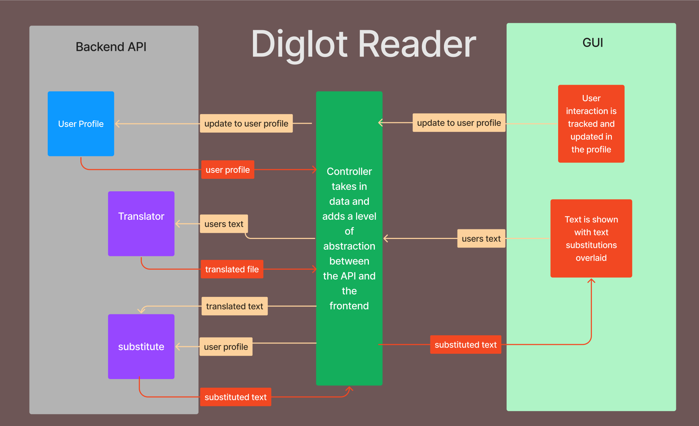
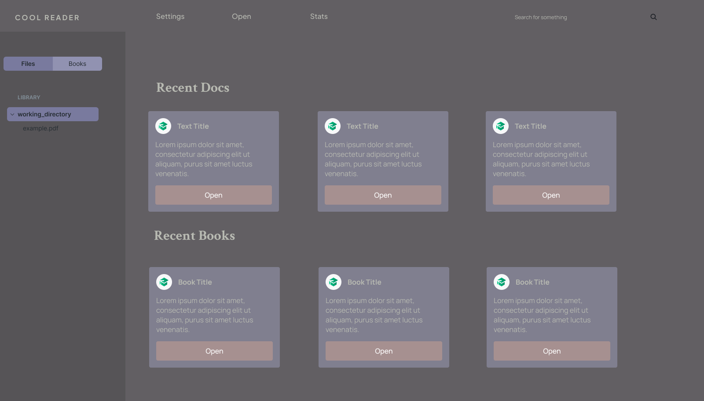

# Intro

For our project we've decided to build a text reader with a Te Reo Māori vocabulary training component. It will allow users to open a variety of text file formats (txt, ePub etc) occasionally substituting words with their Māori translation. The app will include a library of public domain eBooks for users to read. We see this as an option to replace the users default text reader, something akin to adobe pdf reader but for all text. 

Our app will utilise the Diglot Weave approach, replacing words in the text with words from a language they wish to learn, increasing the proportion of text translated the further into the document. The Diglot Weave approach aims to help users learn words by placing them in a context they can understand. At first, we will focus on the Māori language, with the goal of extending to other languages in the future. 

# The team

Our team consists of Jet, Jake, Cody & Matt. 

Jet has almost finished his undergrad computer science and is starting honours next year. He has experience with C++ in the context of graphics and computer vision, as well as designs skills and some artistic ability.

Jake is a third year computer science student with interest in low level programming and design. He has some experience in natural language processing. He is  well practised in working with teams from his time as a chef, however this is his first time building an app as a team from scratch. 

Cody is a third year computer science student with an information science minor, including 4 years of experience in IT. This is his third team based software project. He has experience in NLP, doing research over the summer, which should hopefully prove useful for this project.

Matt is a semi professional fry cook with 28 years of life experience, some of which are in programming. He has heard of C++, but isn't sure why they didn't just call it D, or at least ++C so it would run quicker. 

# What datasets are we using?

For our data we need a high quality English to Māori Dictionary, and repository of public domain books. The latter is easily decided, as Project Gutenberg offers a fantastic database of books to draw from. The dictionary is maybe not quite as straight forward, as although many exist, they are not always up to date and well digitised. We propose to get around this by drawing from as many datasets as we can and using it to inform our final dataset for translating. Some notable sources of this data are the Herbert Willliams' "Dictionary of the Māori Language", and "A Dictionary of Māori Computer & Social Media terms" compiled by Karaitiana N Taiuru. Both of which are released under creative commons. 

To inform things such as which words we should prioritise switching, we will make great use of the research in the field. This will also be informed by the work of David Trye which looked at Māori loan words as they appeared in tweets, which offer a great place to start as being able to understand the Te Reo that is most often used we see as a great starting point for many learners.

# How will we build it? 

We have made a diagram to show the rough outline of the architecture we are considering for the project

  

As seen in the diagram we are trying to split the application into three main areas:

- Backend API
- Controller
- GUI

### Backend API

This is further split into three different sections:

- User Profile
- Translator
- Substitute

We aim to keep each part of the backend isolated, in that it will send and receive data through the controller abstraction layer

### Controller

This will handle the data going between different areas of the code. The GUI will send text and any updates to user data to the controller, which will then make the API calls to coordinate the backend. Once the backend has finished its computation, the controller will then send the result to the GUI. 

### GUI

From a UI design perspective we are aiming to have a low clutter and simplistic design aimed to be easy on the eyes for long reading sessions. We have made some mockups in figma of some of the features that we envision for the app. These mockups will then be transferred to html and css using the Ultralight framework as an html renderer. Figma itself allows for the designs to be exported to html and css. We are considering Ultralight as it allows us to make an app using a UI language we understand, html, but be able to easily couple it with C++. 

 
  

As seen we will have a landing page from which you can open recent books or documents. Additionally there will be a sidebar which will show a typical file system to navigate to files, or optionally look through the user's library. 

# What is our schedule?

Our approach to planning is a mixture of Agile and Waterfall. We have set deliverables that require us to be finished to a clear level, while we intend to spend less time planning and more time adjusting as we go. For this reason we have broken the project up into three phases. Each phase is defined by the expectations of an alpha, beta and 'finished' application.

We used a process of requirements elicitation and planning poker to decide on these features and given them some score of difficulty to estimate their sizes. This is based off of the agile concept of user stories, however we focused on features. While we do not have the experience to confidently give each feature a size, we considered the process vital to ensuring we are all on the same page.

### Alpha (4 weeks)

Features:
* Ability to open and read a file
* Word substitution with Māori translations
* Display of translations

The Alpha milestone focuses on creating a minimum viable product. Our goal is to have an application that implements our core features while being structured and written well enough to avoid large amounts of technical debt. We see this first stage as vitally important to ensuring the overall success of our application. 

Some possible issues we may run into is feature dependency, as much of the core components of the application depend on each other. We will do our best to mitigate this by defining our API's and data formats early, as this will give us something to write to and test with.

Note: The schedule accounts for the mid-semester break.

### Beta (2 weeks)

Features:
* Library tab
* Blacklist / whitelist
* Recent documents on the homepage
* Stats menu for progression tracking
* Word learning tests

The Beta phase aims to expand the app by adding in useful features, it will largely focus on user experience. The focus shifts towards creating a customised learning tool rather than a simple word-switching reader.

### Final Product (3 weeks)

Features:
* Dark mode / Light mode support
* Support for .docx and .pdf files
* Legend for currently switched words
* App documentation

The Final Product phase introduces quality of life features, with a big emphasis on polish. We have allowed flexibility in the schedule, enabling us to address any unforeseen challenges encountered during the Beta phase. The tasks in this phase are organised to minimise dependencies and avoid overcommitting resources.

### Testing:

A core component of the CI/CD approach is tests and as such we will make testing a priority. Each team member will be expected to write good tests for their code, and these tests will be reviewed as a part of the code review process. 

We have set aside time in the beta part of our schedule specifically for user testing. At this point our app will be in a useable state, and each member will be able to use it and we can decide what needs changing, and find bugs that need fixing.

# What apps already exist?

We found in our research that this idea has been looked at many times before. The core concept of our app has a basis in research, with the best known promotion of this concept being the Diglot Weave technique as it became to be known, starting with R. Burling in his "outlandish" 1968 paper. Other similar techniques have been known as the "Clockwork Orange" technique coming from research in the late 90s that had noticed those who read A Clockwork Orange learned and retained Russian slang words very well. 

As for commercial ventures there are some notable examples. Prismatext (prismatext.com) cites the Diglot Weave technique as a core component of its technology. It has public domain books that have been edited by translators to slowly transition into a variety of different languages. Although it itself does not offer the ability to open your own text, the books cost money, and it does not appear to offer Māori as an option. 

We also found that the Clockwork Orange Technique was being used, rather amusingly, to write children's books by onethirdstories (onethirdstories.com). They focus largely on offering physical books and only aimed at younger readers. They also have a fairly limited language selection, Māori not being on the list. 

Another company is Weeve (https://shop.weeve.ie/) which offers both an app and physical books for sale. This one is of particular interest as it is an Irish company that offers texts in Irish, which faces similar challenges to adoption as Māori does. Ultimately, they rely holy on preprepared text to offer their translations, and don't have the ability to open your own documents.

Other more promising apps from a feature point of view do appear in searches, though they often lead nowhere. There is loomVue(https://loomvue.medium.com/loomvue-sneak-peak-320c6e385dba) that seemingly offered an extension to do this but it doesn't appear obvious if this is still around or indeed ever made it to market. It looks as though their approach used machine translation instead of manually doing so, and worked on content the user chose.

Through all of this, we find a mixture of the features we like, yet nothing that is: free, open source, and offers Te Reo Māori as an option. 

# Is there interest in our app?

Measuring interest is not exactly straight forward. The fact that there are commercial companies based around a similar proposition suggests that there is interest in the core idea of mixing a second language into a first language's texts.

We also believe that we offer something unique, that is the ability to read ones own text, and that the language that is on offer is Te Reo Māori. 

There is also a rather different cultural argument to its use in New Zealand, as New Zealand English (NZE) has a strong propensity to use Māori loanwords in place of their English counterparts. Data from the 2021 General Social Survey (GSS) showed that the ability of New Zealander's above the age of 15 to speak some Māori is increasing. Between 2018 and 2021 the proportion of people able to speak more than just a few words or phrases in Māori had risen from 24% to 30%.

The same survey showed that 3 in 5 New Zealander's think that Te Reo should be a core subject in primary school. This suggests that there is at least some demand for Te Reo resources.
